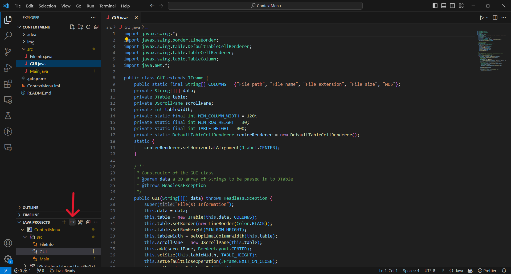
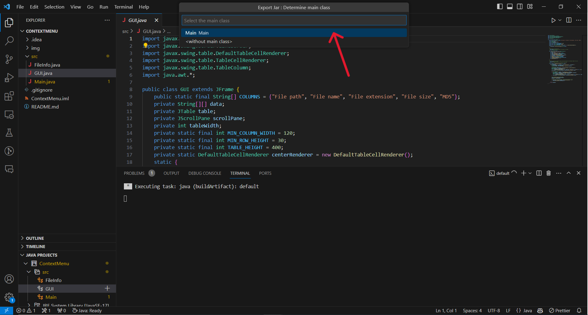
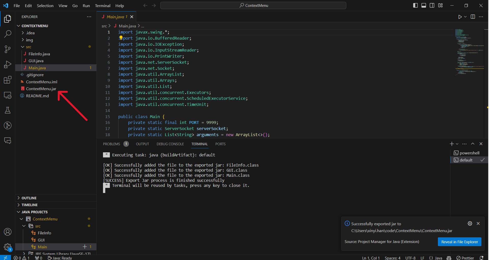
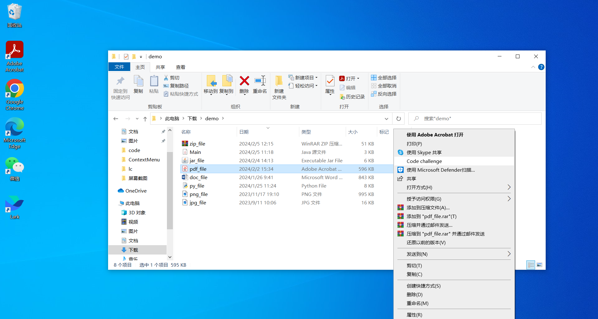
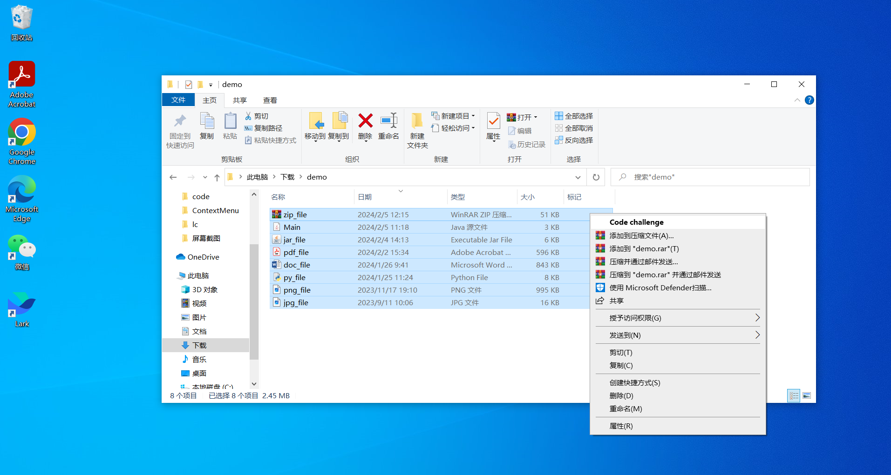

### How to build

- Install [Extension Pack for Java](https://marketplace.visualstudio.com/items?itemName=vscjava.vscode-java-pack)

- Export jar
  

- Select main class
  

- ContextMenu.jar
  

### Modify the Registry

1. Open the Registry Editor by typing `regedit` in the Run Box
2. Navigate to `HKEY_CLASSES_ROOT\*\shell`
3. Create a new key under `shell` named `Code challenge`
4. Under the key `Code challenge`, create another new key named `command`
5. Set the default value of the `command` key to `"<path-to-java.exe>" -jar "<path-to-ContextMenu.jar>" "%1"`, e.g. `"C:\\Program Files\\Java\\jdk-17\\bin\\java.exe" -jar "C:\\Users\\xinyi.han\\code\\ContextMenu\\ContextMenu.jar" "%1"`

### Demo

- Select a single file
  

- Select multiple files
  

- Show file(s) information
  -information.png>)
